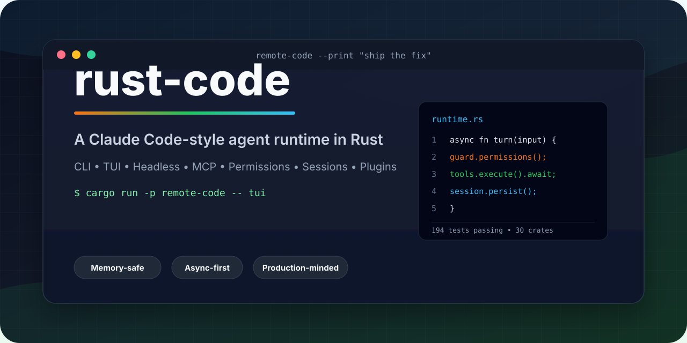
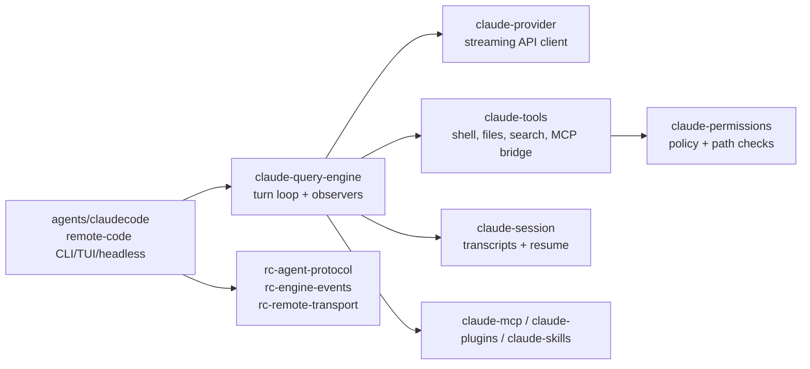

<p align="center">
  
</p>

<p align="center">
  <a href="https://github.com/yanzhi0922/rust-code/actions/workflows/ci.yml"></a>
  
  
  
  
  
</p>

<h3 align="center">A memory-safe, async-first Rust implementation of a Claude Code-style coding agent.</h3>

`rust-code` is the focused Claude Code rewrite slice extracted from the larger `remote-code-rust` platform. It keeps the agent runtime, CLI, TUI, headless execution path, MCP integration, permissions, sessions, plugins, and remote runner primitives without carrying the desktop GUI, Codex, Roo, cloud deployment, or platform-only code.

> This project is not affiliated with Anthropic. "Claude Code" is used only to describe compatibility goals and the style of developer workflow being reimplemented.

## Why It Exists

AI coding agents are becoming core developer infrastructure. The runtime should be inspectable, hackable, fast to ship, and conservative about local execution. This project explores that direction in Rust:

- **Memory-safe by default**: Rust ownership and typed state for long-running agent sessions.
- **Async from the ground up**: `tokio`, streaming providers, websocket transports, and non-blocking tool orchestration.
- **Local-first control**: permissions, shell execution, MCP servers, settings, hooks, and session files stay explicit and auditable.
- **Real CLI surface**: print mode, TUI mode, resume, status, review, worktree, tasks, plugins, MCP, skills, and remote commands.
- **Production-minded internals**: provider retries, compacting, transcripts, telemetry, control-plane primitives, and 194 passing entry-package tests.

## Quick Start

```bash
git clone https://github.com/yanzhi0922/rust-code.git
cd rust-code
cargo run -p remote-code -- --help
```

Run an interactive terminal UI:

```bash
cargo run -p remote-code -- tui
```

Run a one-shot prompt in print mode:

```bash
cargo run -p remote-code -- --print "Explain this repository in 5 bullets"
```

Check local runtime health:

```bash
cargo run -p remote-code -- doctor
```

## What You Get

| Area | Included |
| --- | --- |
| Runtime | Conversation loop, streaming events, compaction, sessions, transcripts |
| Interfaces | CLI, headless print mode, TUI, resume/status/review/worktree/task commands |
| Tools | Bash, file operations, search, todos, web fetch/search hooks, delegated agents |
| Safety | Permission modes, shell classification, path checks, hooks, audit-oriented decisions |
| Extensibility | MCP servers, plugins, skills, settings layers, output styles |
| Providers | Anthropic-style API client, model config, retry/failover, usage and cost accounting |
| Remote primitives | Runner/control-plane protocol, websocket/QUIC transport building blocks |

## Architecture



The workspace is intentionally narrow:

```text
agents/claudecode                 # remote-code binary entry point
crates/claude/*                   # Claude Code-style runtime crates
crates/shared/rc-agent-protocol   # shared agent protocol
crates/shared/rc-engine-events    # runtime event stream types
crates/shared/rc-remote-transport # direct/relay/QUIC transport pieces
```

## Validation

These commands are the current baseline:

```bash
cargo check --workspace --locked
cargo fmt --all -- --check
cargo test -p remote-code --locked
```

Latest local verification before this README refresh:

```text
cargo check --workspace --locked      PASS
cargo fmt --all -- --check            PASS
cargo test -p remote-code --locked    PASS (194 tests)
```

## Project Status

This repository is source-available and early-stage as a standalone public project. The implementation is substantial, but the public packaging, release process, examples, and contributor workflow are still being sharpened.

Good first areas for improvement:

- Package install flows for Windows, macOS, and Linux.
- More screenshots and terminal demos.
- Example MCP server configs and plugin recipes.
- More provider compatibility tests.
- Documentation for permission modes and settings layers.

## Repository Boundary

This repository is deliberately **not** the full `remote-code-rust` platform. It excludes:

- Desktop GUI and PWA code.
- Codex integration.
- Roo integration.
- Cloud deployment assets.
- Large platform acceptance evidence and release scripts.

That boundary keeps this repository easy to understand as one thing: a Rust implementation of a Claude Code-style coding agent.

## License

This repository is currently published under a source-available license. See [LICENSE](LICENSE) for details.
