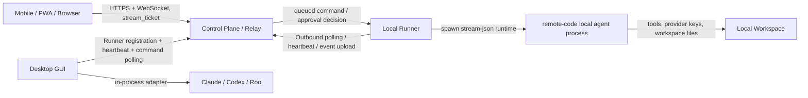
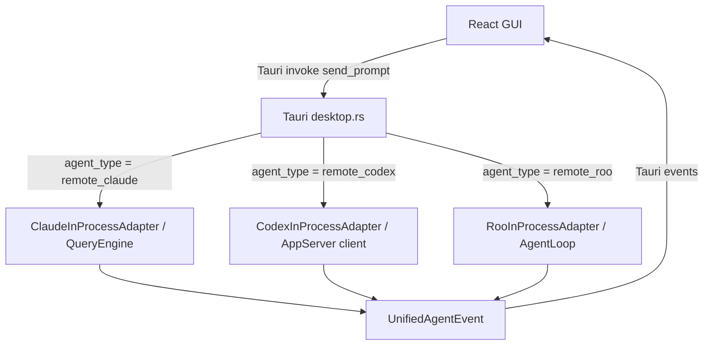

# Remote Code Rust 需求文档

版本: 0.1
日期: 2026-05-18
范围: 本文基于仓库源码、README、ARCHITECTURE、COMPATIBILITY、ROADMAP、PROJECT_STATUS、SECURITY、CI 与部署脚本整理，覆盖当前系统的产品需求、系统需求、接口需求、安全需求、验收标准和后续路线图。

修订记录:

| 日期 | 版本 | 摘要 |
| --- | --- | --- |
| 2026-05-18 | 0.1 | 初版需求基线。 |
| 2026-05-18 | 0.1.1 | 补充远程混合连接默认策略、发布验收 Provider 矩阵和 MCP 测试资源；明确测试密钥不得写入 PRD 或 Git 追踪文件。 |
| 2026-05-18 | 0.1.2 | 增加 Tailscale/tailnet 可选网络模式，用于私有直连、降低公网暴露面和增强远控部署弹性。 |

## 1. 文档目标

本文用于回答三个问题:

1. 这个项目面向什么用户、解决什么问题。
2. 当前代码已经形成哪些产品能力和系统边界。
3. 后续开发、发布、测试和部署应按哪些需求验收。

本文不是单纯的 README 摘要，而是把已有实现反向整理为可执行的需求规格。若实现与文档不一致，应以源码为准，并在后续迭代中更新本文。

## 2. 产品定位

Remote Code Rust 是一个本地优先的 AI 编程助手平台。它把 Claude、Codex、Roo 三类 coding agent 统一到 Rust workspace 中，并提供 CLI/TUI、Tauri 桌面 GUI、Web/PWA 远程控制、Control Plane 云端中继和本地 Runner。

核心定位:

- 用户的代码、工具执行、provider key 和 agent runtime 默认留在本机或可信 Runner。
- 云端只负责认证、配对、事件中继、审批中继、artifact 下载和 Web/PWA 静态资源，不运行 coding agent。
- 同一产品要覆盖本地重度开发、桌面 GUI 管理、手机远控审批、云端 relay 发布和多 agent 协作。
- 可选支持 Tailscale tailnet 部署模式，让桌面、手机/PWA、Relay 在私有网络内直连或半直连，降低公网端口暴露和 NAT/防火墙配置成本。

## 3. 术语

| 术语 | 含义 |
| --- | --- |
| Agent | 具体的 AI 编程引擎。当前支持 Remote Claude、Remote Codex、Remote Roo。 |
| Adapter | 将某个 agent 的原生协议转成统一 `AgentAdapter` trait 和 `UnifiedAgentEvent` 的适配层。 |
| Runner | 运行在用户桌面或可信工作站的本地服务，负责托管 workspace session 和执行本地 agent。 |
| Control Plane | 云端或局域网中的中继服务，负责认证、配对、session 分发、事件扇出、审批和 artifact。 |
| Session | 一次编程会话，包含工作目录、provider、模型、消息、工具调用和状态。 |
| Artifact | 由 runtime 或 runner 产生并通过控制平面登记和下载的文件。 |
| Approval | 工具执行、文件修改、命令执行等需要用户确认时产生的审批请求。 |
| Stream Ticket | 打开 WebSocket 事件流前一次性换取的短期凭证，避免长期 token 暴露在 URL。 |
| MCP | Model Context Protocol，提供外部工具、资源和服务接入。 |
| Skill | 以 `SKILL.md` 和 frontmatter 定义的可发现能力说明。 |
| Tailscale | 基于 WireGuard 的身份感知 mesh VPN/私有网络平台，可把桌面、手机、Relay 放入同一个 tailnet。 |
| Tailnet | Tailscale 中由同一组织或账号管理的一组受信设备网络；设备可通过 tailnet IP 或 MagicDNS 名称互访。 |

## 4. 用户与角色

| 角色 | 目标 | 主要入口 |
| --- | --- | --- |
| 本地开发者 | 在当前项目中让 AI 读代码、改代码、运行命令、解释问题、生成补丁 | CLI、TUI、桌面 GUI |
| 桌面 GUI 用户 | 管理项目、会话、provider、MCP、权限和多 agent | Tauri 桌面应用 |
| 移动端审批者 | 通过手机查看远程会话进度、继续对话、处理审批、下载 artifact | Web/PWA、Tauri Mobile |
| 可信 Runner 管理者 | 将某台桌面或工作站注册到控制平面，并暴露指定 workspace | `remote-code-runner` 或 GUI 内置 Runner |
| 云端 relay 运维 | 部署只负责 relay 的控制平面与 Web/PWA 静态资源 | `remote-code-control-plane`、deploy 脚本 |
| Agent/插件扩展者 | 扩展 provider、tool、MCP、skill、plugin、adapter | Rust crates、JSON-RPC 插件、MCP 配置 |
| 发布工程师 | 构建 Windows 桌面安装包、Linux relay 包、Web/PWA 产物并执行门禁 | CI、scripts、deploy |

## 5. 产品目标

P0 目标:

- G-01: 提供可用的本地 AI 编程 runtime，支持交互式、无头、TUI 和 GUI。
- G-02: 支持多 provider、多协议、流式响应、工具调用、权限控制和会话持久化。
- G-03: 支持 Claude、Codex、Roo 三条 in-process agent 路径，并通过统一事件模型驱动 GUI。
- G-04: 支持本地 Runner 与云端 Control Plane 组成的远程控制闭环。
- G-05: 明确本地执行、云端中继的安全边界，避免云端持有 workspace 和 provider key。
- G-06: 支持 Windows 桌面发布和腾讯云 relay 部署。

P1 目标:

- G-07: 通过 BM25 工具搜索、延迟工具加载和上下文压缩降低上下文占用。
- G-08: 通过 session SQLite + NDJSON transcript 支持恢复、导出、审计和调试。
- G-09: 通过 MCP、Skills、Plugins 支持外部能力扩展。
- G-10: 通过 mobile/PWA 支持远程 prompt、interrupt、approval、artifact 和 timeline。

P2 目标:

- G-11: 深化 Roo 原生权限、token 计算和 MCP 接入。
- G-12: 完成移动端真机打包、推送通知、深链、远程文件预览和远程终端流。
- G-13: 将 checkpoint、git、specialized agents 等能力进一步接入生产 GUI。

## 6. 非目标

- NG-01: 云端 relay 不运行 `remote-code-runner`、`remote-code`、Codex、Roo、Claude agent loop、workspace tooling 或 provider SDK loop。
- NG-02: 云端 relay 不保存用户 provider key，不读取用户 workspace 文件。
- NG-03: Runner 默认不暴露入站端口；直连 runner API 是显式高级模式。
- NG-04: Web/PWA 不应依赖 URL 中的长期 access token；只能临时兼容旧查询参数。
- NG-05: 目前移动端不以应用商店正式发布为既定完成标准，仍需要真机、推送和原生打包验收。
- NG-06: 需求文档不承诺所有 roadmap 项已完成；已规划和已实现需求必须明确区分。
- NG-07: Tailscale 是可选网络增强，不是首发硬依赖；不能替代 Remote Code 自身的账号、设备配对、E2EE、审批、审计和 token 管理。

## 7. 系统总览

### 7.1 代码规模与组成

当前 workspace 通过 `cargo metadata --no-deps` 实测为 231 个 Rust packages:

| 分类 | 数量 | 说明 |
| --- | ---: | --- |
| `agents/claudecode` | 1 | `remote-code` CLI/TUI/headless/runtime 入口 |
| `apps/remote-code-control-plane` | 1 | 云端或局域网中继服务 |
| `apps/remote-code-runner` | 1 | 独立本地 Runner |
| `apps/remote-code-migrate` | 1 | 遗留 profile 导入 |
| `apps/remote-code-gui/src-tauri` | 1 | Tauri v2 桌面和移动 Rust 后端 |
| `crates/adapters` | 3 | Claude/Codex/Roo 三类 agent adapter |
| `crates/claude` | 42 | Claude runtime、provider、tools、session、permissions、MCP、GUI 支撑等 |
| `crates/codex` | 108 | Codex core、app-server、CLI、TUI、plugins、tools、sandbox 等 |
| `crates/roo` | 70 | Roo provider、task、tools、terminal、config、CLI 等 Rust 重写 |
| `crates/shared` | 3 | 共享 agent 协议、engine events、remote transport |

前端主要位于 `apps/remote-code-gui/src`，包含 93 个 TypeScript/TSX 源文件。仓库中 Rust 源文件约 4660 个，测试相关文件约 478 个。

### 7.2 应用入口

| 应用 | 可执行入口 | 核心职责 |
| --- | --- | --- |
| `remote-code` | `agents/claudecode/src/main.rs` | CLI/TUI/headless、配置加载、session、provider、tool runtime、权限、MCP/Plugins/Skills、远程 CLI |
| `remote-code-gui` | `apps/remote-code-gui/src-tauri/src/main.rs` | 桌面 GUI、移动命令、三 agent in-process routing、内置 Runner |
| `remote-code-control-plane` | `apps/remote-code-control-plane/src/main.rs` | HTTP/WS API、runner/session/approval/artifact/event/device 管理 |
| `remote-code-runner` | `apps/remote-code-runner/src/main.rs` | 本地 workspace 注册、heartbeat、session 托管、stream-json 桥接 |
| `remote-code-migrate` | `apps/remote-code-migrate/src/main.rs` | 遗留 profile 导入 |
| `codex`/`codex-tui` 等 | `crates/codex/*` | Codex 独立 CLI/TUI/app-server 能力 |
| `roo` | `crates/roo/roo-cli/src/main.rs` | Roo CLI |

### 7.3 生产拓扑



### 7.4 本地 GUI 执行拓扑



## 8. 核心业务场景

### 8.1 本地 CLI/TUI 编程

用户在项目目录执行 `remote-code`，通过交互式 TUI、headless pipe 或 `--print` 模式提交需求。系统读取配置、加载 provider、注册工具，进入 provider 对话循环，必要时请求权限，执行工具并持久化 session。

验收点:

- 支持 `remote-code --print`、`remote-code tui`、stdin headless、`stream-json` 输入输出。
- 支持 resume、continue、session export、doctor、status。
- 工具调用和权限请求必须可追踪、可审计、可恢复。

### 8.2 桌面 GUI 编程

用户打开 Remote Code 桌面应用，添加项目目录，选择 provider/profile/model/agent，创建 session，在 Chat UI 中发送 prompt。GUI 后端根据 session 中保存的 `agent_type` 选择 Claude、Codex 或 Roo 的 in-process adapter。

验收点:

- 创建 session 前必须选择已管理项目目录。
- 同一 session 同时只能运行一个 prompt。
- prompt 为空或超过 1 MB 必须拒绝。
- tool progress、streaming delta、subtask、context usage、permission modal 和 prompt done 必须通过 Tauri event 反馈。

### 8.3 手机或 PWA 远控桌面

用户在移动浏览器或 PWA 打开控制平面地址，完成 bootstrap 或 pairing，选择 active session，查看 timeline、approval、artifact，发送 prompt 或 interrupt。事件流通过 stream ticket 建立 WebSocket；命令通过 control plane relay 到本地 runner。

验收点:

- 控制平面要求认证时必须展示远程认证入口。
- pairing 成功后刷新页面应恢复认证态。
- runner 离线时应禁用 prompt 和 interrupt。
- approval 与 artifact 必须与 timeline 同步可见。
- 离线或重连时命令进入 offline queue，成功连接后尽力补发。

### 8.4 云端 relay 部署

运维部署 `remote-code-control-plane` 和 Web/PWA 静态资源到腾讯云或同类主机。该主机不得运行 agent、runner、cargo、rustc 或保存 workspace/provider secret。

验收点:

- systemd 仅运行 control plane。
- `/healthz` 正常。
- `/download` 和 `/downloads/*` 根据部署策略受控暴露。
- bootstrap secret 配置完成后，可信设备能领取首个 token。
- 本地 desktop runner 能注册、heartbeat、接收 session、上传 runtime events。

### 8.5 多 agent 协作

系统支持在统一 `AgentAdapter` trait 下运行三类 agent，并在 Claude runtime 内支持 agent/task/team/mailbox 等协作工具。

验收点:

- GUI session 创建时能保存 `remote_claude`、`remote_codex`、`remote_roo`。
- 三类 adapter 均能发出 `UnifiedAgentEvent`。
- 事件必须被映射为 GUI 能理解的 streaming、tool、permission、subtask、context 和 completion 状态。

## 9. 功能需求

### 9.1 CLI 与 Runtime

| ID | 需求 |
| --- | --- |
| FR-CLI-01 | 系统必须提供 `remote-code` CLI，支持 prompt 参数、stdin 输入、`--print`、`--input-format`、`--output-format`、`--max-turns`、`--cwd`、`--profile-dir`、`--session-id`、`--resume`、`--continue`。 |
| FR-CLI-02 | CLI 必须支持 `doctor`、`status`、`sessions`、`review`、`worktree`、`tasks`、`export`、`agents`、`plugins`、`mcp`、`skills`、`migrate`、`remote`、`ssh`、`update` 等子命令。 |
| FR-CLI-03 | Runtime 必须从 CLI、环境变量、profile、project settings、local settings 合并配置，并保留 setting source 信息供诊断。 |
| FR-CLI-04 | Runtime 必须支持 text、JSON、stream-json 输入输出，以便 GUI/Runner/headless 集成。 |
| FR-CLI-05 | Runtime 必须在非 headless 交互入口支持首次运行向导和 API key helper。 |
| FR-CLI-06 | Runtime 必须在执行结束后处理 pending memory extraction，并清理临时 MCP config 文件。 |

### 9.2 Agent 统一协议

| ID | 需求 |
| --- | --- |
| FR-AGENT-01 | 系统必须定义统一 `AgentAdapter` trait，覆盖 start、send_message、cancel、resolve_permission、stop、is_alive、info、agent_type。 |
| FR-AGENT-02 | 系统必须支持 `remote_claude`、`remote_codex`、`remote_roo` 三种 `AgentType`。 |
| FR-AGENT-03 | 所有 adapter 必须将原生事件转成 `UnifiedAgentEvent`，至少覆盖 started、ready、message_delta、tool_call_started/progress/completed、permission_request、subtask、context_usage/overflow/compacted、error、completed、stopped。 |
| FR-AGENT-04 | Codex adapter 必须保留原生 app-server notification envelope，用于 GUI 获得协议级 parity。 |
| FR-AGENT-05 | GUI 发送 prompt 时必须按 session 保存的 `agent_type` 路由到对应 in-process adapter，不再依赖 bridge 子进程。 |
| FR-AGENT-06 | Adapter 必须支持 prompt 取消，并在取消时释放 running prompt slot。 |
| FR-AGENT-07 | 权限请求必须可从 GUI 或远程客户端返回 adapter 的 `resolve_permission()`。Roo 权限弹窗完整接线属于后续 P1 需求。 |

### 9.3 Provider 与模型

| ID | 需求 |
| --- | --- |
| FR-PROVIDER-01 | Claude runtime provider 层必须支持标准化请求模型: provider name、protocol family、base URL、model、auth、header override、timeout、retry/backoff。 |
| FR-PROVIDER-02 | 必须支持 OpenAI、Anthropic、GLM/ZhipuAI、AWS Bedrock、Google Vertex AI 作为主要 provider family。 |
| FR-PROVIDER-03 | Roo adapter 必须能使用 Roo 原生 provider 后端，当前覆盖 Anthropic、OpenAI、OpenAI Native、OpenRouter、DeepSeek、Google/Gemini、Ollama、LMStudio、xAI、Mistral、Fireworks、LiteLLM、Qwen、MiniMax、Moonshot、ZAI、SambaNova、BaseTen、Poe、Requesty、Unbound、Vercel、Roo、AWS/Bedrock 等。 |
| FR-PROVIDER-04 | Provider 必须支持 SSE 流式响应，并提供 token delta、tool call、tool result、usage、error 回调。 |
| FR-PROVIDER-05 | Provider 必须支持健康跟踪、自动 fallback、熔断、指数退避、jitter 和 `Retry-After`。 |
| FR-PROVIDER-06 | Anthropic 协议发送前必须执行消息规范化，确保 role alternation、tool_use/tool_result 配对、thinking block 清理、空内容修正。 |
| FR-PROVIDER-07 | SSE 流必须有 idle watchdog，默认 90 秒，可通过 `CLAUDE_STREAM_IDLE_TIMEOUT_MS` 与 `CLAUDE_STREAM_WATCHDOG_DISABLED` 配置。 |
| FR-PROVIDER-08 | Extended thinking budget 必须被限制在 `max_output_tokens - 1` 内，避免 provider API 400。 |
| FR-PROVIDER-09 | GUI 必须支持 provider config 的保存、删除、激活、profile 切换和 keyring 读取。 |
| FR-PROVIDER-10 | 发布验收必须保留既有主路径 Claude/Anthropic、Codex/OpenAI、Roo/OpenRouter；MiniMax Token Plan 与 KuaiKAT Coding Plan 作为补充发布验收 Provider，不替代主路径。 |
| FR-PROVIDER-11 | MiniMax/KuaiKAT 等测试 Provider 的 API key 必须来自环境变量或系统安全存储，需求文档、测试报告、日志、截图和 Git 追踪文件不得保存明文 key。 |

### 9.4 工具系统

| ID | 需求 |
| --- | --- |
| FR-TOOL-01 | 系统必须提供内置工具注册、schema 生成、执行调度、进度事件和结果存储。 |
| FR-TOOL-02 | 工具必须按权限类别分类，至少包含 Read、Edit、Bash、Mcp、Agent。 |
| FR-TOOL-03 | 文件工具必须支持目录列举、文件读取、文本搜索、写文件、替换、编辑和 notebook 编辑。 |
| FR-TOOL-04 | 搜索工具必须支持 glob、grep、LSP，并提供 grep 的 glob、context、case-insensitive、type、multiline、head_limit、offset 等参数。 |
| FR-TOOL-05 | 执行工具必须支持 bash、PowerShell、REPL、terminal capture、daemon、workflow、cron、remote trigger。 |
| FR-TOOL-06 | Web 工具必须支持 web_search、web_fetch、web_browser，并在需要网络访问时按权限策略处理。 |
| FR-TOOL-07 | 协作工具必须支持 agent、send_message、team_create、team_status、team_list、team_delete、broadcast_message、list_peers。 |
| FR-TOOL-08 | 任务工具必须支持 task_create、task_get、task_list、task_update、task_output、task_stop、todo_write。 |
| FR-TOOL-09 | 计划工具必须支持 enter_plan_mode、exit_plan_mode、verify_plan。 |
| FR-TOOL-10 | 上下文和辅助工具必须支持 tool_search、ctx_inspect、snip、sleep、config_read、discover_skills、skill_execute、voice_input、send_user_file、review_artifact。 |
| FR-TOOL-11 | MCP resource 工具必须只在连接的 MCP server 支持 resources 时注入，避免暴露无效 schema。 |
| FR-TOOL-12 | BM25 `tool_search` 必须索引工具名、描述、分类、别名和搜索提示，用于延迟加载工具描述。 |
| FR-TOOL-13 | 大型工具结果必须按策略截断、持久化或摘要，避免污染上下文。 |

### 9.5 权限与安全执行

| ID | 需求 |
| --- | --- |
| FR-PERM-01 | 系统必须支持权限模式: `default`、`acceptEdits`、`bypassPermissions`、`dontAsk`、`plan`。权限 crate 内还包含 auto、bubble 等扩展模式，进入产品 UI 时必须明确语义。 |
| FR-PERM-02 | 默认模式下读操作自动允许，编辑和命令需要询问。 |
| FR-PERM-03 | `acceptEdits` 模式允许读和编辑自动通过，但命令仍询问。 |
| FR-PERM-04 | `bypassPermissions` 模式允许读、编辑、命令自动通过，并必须受 kill switch、配置和审计约束。 |
| FR-PERM-05 | `dontAsk` 和 `plan` 模式必须拒绝编辑和命令类操作。 |
| FR-PERM-06 | 权限系统必须支持规则引擎、通配符匹配、session scoped rule、permission update、audit records 和 shadowed rule detection。 |
| FR-PERM-07 | 文件路径必须进行 traversal、null byte、scope 和额外工作目录检查。 |
| FR-PERM-08 | Shell 命令必须做危险模式检测，覆盖高危删除、sudo、curl pipe shell、force push 等场景。 |
| FR-PERM-09 | GUI 必须展示权限弹窗，并允许用户 approve、deny 或传回带说明的结果。 |
| FR-PERM-10 | 远程 approval 必须可以从 control plane、runner、mobile/PWA 往返到本地 runtime。 |

### 9.6 会话、记忆与上下文

| ID | 需求 |
| --- | --- |
| FR-SESSION-01 | Session 必须以 SQLite 保存 metadata，以 NDJSON transcript 保存事件和对话。 |
| FR-SESSION-02 | Session metadata 必须包含 session id、parent session id、title、cwd、provider、model、created/updated time、transcript path、archived。 |
| FR-SESSION-03 | SessionStore 必须支持 ensure、append conversation、append named event、list active、list archived、archive、restore、load conversation、export。 |
| FR-SESSION-04 | SessionStore 必须启用 WAL、`synchronous=NORMAL` 和 busy timeout，支持长会话期间的并发读写稳健性。 |
| FR-SESSION-05 | GUI 创建 session 时必须将 `agent_type` 作为 named event 写入 transcript。 |
| FR-SESSION-06 | Runtime 必须支持自动 token 估算、context usage、overflow 事件和 compaction 事件。 |
| FR-SESSION-07 | Runtime 必须支持至少 5 种上下文压缩策略和 session memory 压缩。 |
| FR-SESSION-08 | 记忆系统必须支持 RC.md 持久化记忆，并区分全局和项目作用域。 |
| FR-SESSION-09 | 会话导出必须支持至少一种用户可读 bundle，GUI 提供 export session bundle 入口。 |

### 9.7 桌面 GUI

| ID | 需求 |
| --- | --- |
| FR-GUI-01 | 桌面 GUI 必须基于 Tauri v2、React 19、TypeScript、Vite。 |
| FR-GUI-02 | GUI 必须支持本地模式和远程模式。远程模式由 runtime/env/query 判断。 |
| FR-GUI-03 | 本地模式必须提供项目管理、session 列表、archive/restore、conversation、chat input、workspace overview、permission modal。 |
| FR-GUI-04 | GUI 必须支持 agent 选择，并在创建 session 时保存目标 agent。 |
| FR-GUI-05 | GUI 必须支持 Provider/Model/Runtime 管理，包括 provider config、profile、API key、base URL、protocol、permission mode。 |
| FR-GUI-06 | GUI 必须支持 MCP 管理: list、runtime inventory、save、toggle、remove、reset。 |
| FR-GUI-07 | GUI 必须支持 Codex app-server 操作面板，覆盖 thread、turn、account、apps、exec、MCP、skills、plugins、marketplace、review、config、feedback、realtime、device key、filesystem、fuzzy search 等命令。 |
| FR-GUI-08 | GUI 必须处理 streaming delta、tool start/progress/result、subtask、batch progress、context usage/overflow/compacted、prompt done、recoverable error。 |
| FR-GUI-09 | GUI 必须在 HMR 或重复 init 时清理旧 Tauri event listener，避免重复事件。 |
| FR-GUI-10 | GUI 必须提供错误边界，避免运行时异常造成白屏。 |
| FR-GUI-11 | GUI 必须支持中英文远程界面文案和移动端响应式布局。 |

### 9.8 远程 Web/PWA 与移动端

| ID | 需求 |
| --- | --- |
| FR-REMOTE-01 | RemoteApp 必须支持 health check、auth gate、bootstrap、pairing、token refresh、session list、active session persistence。 |
| FR-REMOTE-02 | RemoteApp 必须支持 timeline events、approvals、artifacts、send prompt、interrupt、approval decision、artifact download。 |
| FR-REMOTE-03 | RemoteApp 必须使用 stream ticket 构造 WebSocket URL，不默认使用长期 token query。 |
| FR-REMOTE-04 | RemoteApp 必须支持 connection state: idle、probing、connecting、open、reconnecting、error。 |
| FR-REMOTE-05 | RemoteApp 必须支持离线命令队列，网络恢复后尽力 drain。 |
| FR-REMOTE-06 | 桌面端与移动端/远端之间的混合连接策略默认使用智能评分，按可达性、延迟、E2EE 可用性、稳定性和用户偏好在 Relay、Direct WebSocket、Outbound Polling、QUIC 之间选择。 |
| FR-REMOTE-07 | 用户必须可在高级设置中手动指定远程传输策略；手动指定优先于智能评分。连接失败后进入重连流程，再重新评分或按用户指定策略执行 fallback。 |
| FR-REMOTE-08 | MobileRemoteApp 必须适配触控、小屏、底部 sheet、移动端输入、审批和 artifact 操作。 |
| FR-REMOTE-09 | 移动端初始化必须支持网络状态、可选生物识别、haptics、secure storage、push token 注册、deep link 解析。 |
| FR-REMOTE-10 | 浏览器/PWA 不得把远程 access token 和 refresh token 持久保存在 localStorage；当前实现应优先 sessionStorage 与 Tauri secure store，并清理 legacy localStorage token。 |
| FR-REMOTE-11 | URL 中的 `access_token`、`token`、`pairing_offer`、`pairing_secret` 等敏感参数必须被清除。 |
| FR-REMOTE-12 | 当桌面端、移动端/PWA 或 Relay 均加入同一 tailnet 时，Tailscale tailnet direct 应作为 `smart` 策略的可选候选路径；用户也必须能手动指定 `tailscale`/`tailnet` 路径或禁用它。 |

### 9.9 Control Plane

| ID | 需求 |
| --- | --- |
| FR-CP-01 | Control Plane 必须提供 `/healthz` 健康检查。 |
| FR-CP-02 | Control Plane 必须提供 `/v1/meta` 返回 service、version、phase、bind、public base URL、profile、state DB、artifact root、auth 状态。 |
| FR-CP-03 | Control Plane 必须支持 runner register、heartbeat、list、get、runner scoped sessions/approvals/artifacts/events。 |
| FR-CP-04 | Control Plane 必须支持 session create/list/get/state update/command/events/approvals/artifacts。 |
| FR-CP-05 | Control Plane 必须支持 timeline event list 和 WebSocket stream，且支持 session scoped、runner scoped、global scoped stream。 |
| FR-CP-06 | Control Plane 必须支持 approval create/list/get/decision，并能 relay 给 inbound runner 或 enqueue 给 outbound polling runner。 |
| FR-CP-07 | Control Plane 必须支持 artifact create/list/get/download，文件名必须 sanitize，路径必须限制在 artifact root 下。 |
| FR-CP-08 | Control Plane 必须支持 trusted device、bootstrap claim、pairing offer/accept、token refresh、device revoke、push token registration。 |
| FR-CP-09 | Control Plane 必须支持 stream ticket 创建和消费，并将 ticket 绑定到目标 path。 |
| FR-CP-10 | Control Plane 必须支持下载页和安装包文件服务，但部署时必须明确认证和暴露策略。 |
| FR-CP-11 | Control Plane QUIC listener 必须默认关闭，仅在配置 QUIC bind/cert/key 且用户或智能策略选择 QUIC 时启动；发布验收必须覆盖 QUIC 受控环境 E2E。 |

### 9.10 Runner

| ID | 需求 |
| --- | --- |
| FR-RUNNER-01 | Runner 必须支持 runner id、control plane URL、bind、public base URL、auth token、control plane auth token、heartbeat interval、max parallel sessions、profile dir、remote-code bin、mode。 |
| FR-RUNNER-02 | Runner 必须维护可服务 workspace 列表，每个 workspace 包含 workspace id、root dir、writable。 |
| FR-RUNNER-03 | Runner 必须向 control plane 注册并定期 heartbeat，heartbeat 间隔不得超过 lease TTL 的一半。 |
| FR-RUNNER-04 | Runner 默认模式必须为 outbound polling，不需要入站端口。 |
| FR-RUNNER-05 | inbound 模式必须受 runner API token 保护，且与 control plane token 分离。 |
| FR-RUNNER-06 | Runner 托管 session 时必须以 `--input-format stream-json --output-format stream-json --print` 启动本地 `remote-code`，并设置 cwd、profile dir、session id。 |
| FR-RUNNER-07 | Runner 必须把 stdout stream-json 转成 control plane runtime events，同时保留 direct WebSocket subscribers 的 raw stream。 |
| FR-RUNNER-08 | Runner 必须把 runtime `control_request` 映射为 approval，并把 approval decision 映射回 runtime `control_response`。 |
| FR-RUNNER-09 | Runner 必须支持 send_prompt 与 interrupt 命令。 |
| FR-RUNNER-10 | Runner 必须对上传失败的 runtime events 做有界缓冲，每个 session 最大 500 条，防止内存无限增长。 |

### 9.11 Remote Transport

| ID | 需求 |
| --- | --- |
| FR-TRANSPORT-01 | 共享 transport 层必须定义 Direct WebSocket、Server Relay、Outbound Polling、Hybrid、QUIC 五种策略。 |
| FR-TRANSPORT-02 | Transport command 必须至少支持 send_prompt、interrupt、respond_to_approval。 |
| FR-TRANSPORT-03 | Transport 必须暴露 connect、send_command、health_probe、disconnect、state、active_strategy、metrics。 |
| FR-TRANSPORT-04 | TLS 默认必须 enforce HTTPS，不接受 self-signed，除非高级配置明确允许并提供证书指纹。 |
| FR-TRANSPORT-05 | Transport metrics 必须覆盖 latency、events received/dropped、reconnect、strategy switches、bytes sent/received、last event time。 |
| FR-TRANSPORT-06 | 默认 `smart` 策略必须产出可诊断评分结果；用户手动指定 `relay`、`direct`、`outbound`、`quic`、`hybrid` 或 `tailscale` 时，UI 必须展示当前策略和最近失败原因。 |
| FR-TRANSPORT-07 | QUIC 作为正式传输进入发布门禁，必须通过连接、E2EE、事件流、prompt、approval、artifact 的受控环境 E2E；失败不得仅以 Relay fallback 视为通过。 |
| FR-TRANSPORT-08 | Tailscale 模式不得新增单独业务协议；它应作为 Direct WebSocket/HTTPS/QUIC 的私有网络承载路径，仍复用 Remote Code 的设备 token、stream ticket、E2EE 和审批协议。 |
| FR-TRANSPORT-09 | Tailscale 路径选择必须可观测，至少展示 tailnet hostname/IP、当前策略、最近探测延迟、失败原因和是否命中用户手动指定策略。 |

### 9.12 MCP、Skills、Plugins

| ID | 需求 |
| --- | --- |
| FR-EXT-01 | MCP 必须支持 stdio、HTTP、WebSocket 三种传输配置。 |
| FR-EXT-02 | GUI 和 CLI 都必须能列举、添加、删除、启用、禁用、重置 MCP server。 |
| FR-EXT-03 | MCP runtime inventory 必须区分来源和启用状态，并可选择连接检查。 |
| FR-EXT-04 | Skills 必须通过 `SKILL.md` frontmatter 发现、索引、展示和执行。 |
| FR-EXT-05 | Plugins 必须通过 manifest 和 JSON-RPC stdio 进程隔离方式运行，不直接嵌入任意 JS 代码。 |
| FR-EXT-06 | Plugin CLI 必须支持 list、inspect、invoke、validate、install、remove、enable、disable、update。 |
| FR-EXT-07 | 发布验收 MCP 必须覆盖 MiniMax、context7、sequentialthinking、memory、puppeteer；验收至少包含启动、健康检查、工具发现、一次真实调用、失败提示和密钥脱敏日志。 |

### 9.13 部署与发布

| ID | 需求 |
| --- | --- |
| FR-DEPLOY-01 | Windows 桌面安装包必须由 Tauri NSIS 生成，面向当前用户安装。 |
| FR-DEPLOY-02 | Web/PWA 发布必须构建 `apps/remote-code-gui/dist` 并通过部署脚本原子替换静态资源。 |
| FR-DEPLOY-03 | 腾讯云 relay 部署必须只上传 Linux release control-plane binary 和静态前端产物，不上传源码，不在服务器编译。 |
| FR-DEPLOY-04 | GitHub Release 必须额外产出 relay-only Linux control-plane 包。 |
| FR-DEPLOY-05 | 发布前必须执行格式、diff whitespace、cargo check、clippy、cargo audit、npm audit、npm test、npm build 等门禁。 |
| FR-DEPLOY-06 | 正式桌面发布必须在磁盘空间充足的 Windows 发布机上完成真实 `npm run desktop:build` 和远控端到端回归。 |

## 10. 外部接口需求

### 10.1 Control Plane HTTP/WS API

| Endpoint | 方法 | 说明 |
| --- | --- | --- |
| `/healthz` | GET | 健康检查 |
| `/v1/bootstrap/claim` | POST | 使用 bootstrap secret 领取首个可信设备 |
| `/v1/pairing/accept` | POST | 接受 pairing offer |
| `/v1/auth/refresh` | POST | refresh token 换取 access token |
| `/v1/meta` | GET | 服务元信息 |
| `/v1/stream-ticket` | POST | 为事件流创建一次性 ticket |
| `/v1/devices` | GET | 列出可信设备 |
| `/v1/devices/{device_id}` | DELETE | 撤销设备 |
| `/v1/devices/push-token` | POST | 注册移动推送 token |
| `/v1/events` | GET | 列出 timeline events |
| `/v1/events/stream` | GET WS | 全局事件流 |
| `/v1/runners` | GET | 列出 runners |
| `/v1/runners/register` | POST | runner 注册 |
| `/v1/runners/{runner_id}` | GET | runner 详情 |
| `/v1/runners/{runner_id}/heartbeat` | POST | runner heartbeat |
| `/v1/runners/{runner_id}/commands/pull` | POST | outbound runner 拉取命令 |
| `/v1/runners/{runner_id}/events` | GET | runner scoped events |
| `/v1/runners/{runner_id}/events/stream` | GET WS | runner scoped event stream |
| `/v1/runners/{runner_id}/sessions` | GET | runner scoped sessions |
| `/v1/runners/{runner_id}/approvals` | GET | runner scoped approvals |
| `/v1/runners/{runner_id}/approvals/stream` | GET WS | runner scoped approval stream |
| `/v1/runners/{runner_id}/artifacts` | GET | runner scoped artifacts |
| `/v1/sessions` | GET/POST | session 列表与创建 |
| `/v1/sessions/{session_id}` | GET | session 详情 |
| `/v1/sessions/{session_id}/state` | POST | session 状态更新 |
| `/v1/sessions/{session_id}/commands` | POST | send prompt 或 interrupt |
| `/v1/sessions/{session_id}/events` | GET/POST | session events 列表与创建 |
| `/v1/sessions/{session_id}/events/stream` | GET WS | session scoped event stream |
| `/v1/sessions/{session_id}/approvals` | GET/POST | session approvals 列表与创建 |
| `/v1/sessions/{session_id}/approvals/stream` | GET WS | session scoped approval stream |
| `/v1/sessions/{session_id}/artifacts` | GET/POST | session artifacts 列表与创建 |
| `/v1/approvals` | GET | approvals 列表 |
| `/v1/approvals/stream` | GET WS | approvals stream |
| `/v1/approvals/{approval_id}` | GET | approval 详情 |
| `/v1/approvals/{approval_id}/decision` | POST | approval decision |
| `/v1/artifacts` | GET | artifacts 列表 |
| `/v1/artifacts/{artifact_id}` | GET | artifact 详情 |
| `/v1/artifacts/{artifact_id}/download` | GET | artifact 下载 |
| `/v1/pairing/offers` | POST | 创建 pairing offer |
| `/download` | GET | 下载页 |
| `/downloads/{filename}` | GET | 安装包或静态下载文件 |

### 10.2 Runner API

| Endpoint | 方法 | 说明 |
| --- | --- | --- |
| `/healthz` | GET | Runner 健康检查 |
| `/v1/meta` | GET | Runner 元信息 |
| `/v1/sessions` | GET/POST | 本地 session 列表与创建 |
| `/v1/sessions/{session_id}` | GET | session 详情 |
| `/v1/sessions/{session_id}/state` | POST | session 状态更新 |
| `/v1/sessions/{session_id}/commands` | POST | prompt 或 interrupt |
| `/v1/sessions/{session_id}/events/stream` | GET WS | direct session event stream |
| `/v1/sessions/{session_id}/approvals` | GET/POST | session approvals |
| `/v1/approvals` | GET | approvals 列表 |
| `/v1/approvals/{approval_id}` | GET | approval 详情 |
| `/v1/approvals/{approval_id}/decision` | POST | approval decision |

### 10.3 Tauri Commands

桌面 GUI 暴露大量 Tauri command，应按能力域维护:

- App/session: `init_app`、`list_sessions`、`list_archived_sessions`、`get_session_conversation`、`get_session_tasks`、`create_session`、`send_prompt`、`cancel_prompt`、`archive_session`、`restore_session`。
- Provider/runtime/settings: `get_provider_info`、`get_runtime_status`、`run_doctor_report`、`get_settings`、`update_provider`、`list_provider_configs`、`save_provider_config`、`delete_provider_config`、`set_active_provider`、`switch_profile`。
- MCP: `list_mcp_servers`、`list_runtime_mcp_inventory`、`save_mcp_server`、`toggle_mcp_server`、`remove_mcp_server`、`reset_mcp_servers`。
- Permissions: `resolve_permission_request`、`resolve_roo_permission_request`、`resolve_claude_permission_request`。
- Codex app-server parity: thread、turn、model、collaboration mode、account、apps、exec、MCP、skills、plugins、marketplace、review、config、feedback、memory、realtime、device key、filesystem、fuzzy file search、adapter stop/restart。
- Projects and agents: `list_projects`、`add_project`、`remove_project`、`pick_folder`、`list_available_agents`、`install_agent`、`uninstall_agent`。
- Mobile: `mobile_is_mobile`、haptics、biometric、secure store、artifact download/share、push、downloaded file management。
- QUIC: `quic_connect`、`quic_send_command`、`quic_disconnect`、`quic_state`、`quic_health_probe`、`quic_get_metrics`。
- GUI embedded runner: `remote_get_status`、`remote_set_password`、`remote_set_username`、`remote_set_credentials`、`remote_get_username`、`remote_get_connection_info`、`remote_set_connection`、`remote_start_service`、`remote_has_password`。

## 11. 配置与环境变量

### 11.1 运行时配置来源

配置优先级和来源必须可诊断:

- CLI 参数。
- 环境变量。
- 显式 `--settings` 文件。
- profile settings。
- legacy-import settings。
- 用户级 `.claude/settings.json`。
- 项目级 `.remote-code/settings.json`、`.claude/settings.json`。
- 本地覆盖 `.remote-code/settings.local.json`、`.claude/settings.local.json`。

### 11.2 关键环境变量

| 变量 | 说明 |
| --- | --- |
| `ANTHROPIC_API_KEY` | Anthropic key |
| `OPENAI_API_KEY` | OpenAI key |
| `GLM_API_KEY` | GLM/ZhipuAI key |
| `REMOTE_CODE_API_KEY` | Remote Code/Anthropic alias |
| `REMOTE_CODE_PERMISSION_MODE` | CLI 默认权限模式 |
| `REMOTE_CODE_PROFILE_DIR` | profile 目录 |
| `REMOTE_CODE_CONTROL_PLANE_BIND` | control plane bind |
| `REMOTE_CODE_CONTROL_PLANE_PUBLIC_BASE_URL` | control plane public URL |
| `REMOTE_CODE_CONTROL_PLANE_AUTH_TOKEN` | control plane bearer token |
| `REMOTE_CODE_CONTROL_PLANE_BOOTSTRAP_SECRET` | 首设备 bootstrap secret |
| `REMOTE_CODE_CONTROL_PLANE_USER_KEY_HASHES` | 允许用户名/密码派生 user-key 的 SHA-256 hash 列表 |
| `REMOTE_CODE_CONTROL_PLANE_QUIC_ENABLE` | 开启 Control Plane QUIC listener；默认关闭，且仍必须同时配置 bind/cert/key。`REMOTE_CODE_CONTROL_PLANE_QUIC_EXPERIMENTAL` 仅作为旧部署兼容别名保留，不应再写入新部署文档 |
| `REMOTE_CODE_CONTROL_PLANE_QUIC_BIND` | QUIC UDP bind |
| `REMOTE_CODE_CONTROL_PLANE_QUIC_CERT` | QUIC cert |
| `REMOTE_CODE_CONTROL_PLANE_QUIC_KEY` | QUIC private key |
| `REMOTE_CODE_RUNNER_ID` | runner id |
| `REMOTE_CODE_RUNNER_BIND` | runner API bind |
| `REMOTE_CODE_RUNNER_PUBLIC_BASE_URL` | direct runner public URL |
| `REMOTE_CODE_RUNNER_AUTH_TOKEN` | direct runner API token |
| `REMOTE_CODE_RUNNER_MODE` | `outbound` 或 `inbound` |
| `REMOTE_CODE_RUNNER_HEARTBEAT_SECS` | heartbeat 秒数 |
| `REMOTE_CODE_RUNNER_MAX_PARALLEL_SESSIONS` | 最大并发 session |
| `REMOTE_CODE_RUNNER_REMOTE_CODE_BIN` | runner 启动的 `remote-code` 路径 |
| `REMOTE_CODE_ALLOW_QUERY_ACCESS_TOKEN` | control plane 旧查询 token 兼容开关，仅临时使用 |
| `REMOTE_CODE_RUNNER_ALLOW_QUERY_ACCESS_TOKEN` | runner 旧查询 token 兼容开关，仅临时使用 |
| `VITE_REMOTE_CONTROL_PLANE_URL` | Web/PWA 默认 control plane URL |
| `VITE_REMOTE_CODE_TRANSPORT_MODE` | remote transport mode，默认 `smart`；允许用户或部署配置指定 `relay`、`direct`、`outbound`、`quic`、`hybrid`、`tailscale` |
| `REMOTE_CODE_TAILSCALE_ENABLED` | 可选规划项；启用 Tailscale/tailnet 候选路径探测 |
| `REMOTE_CODE_TAILSCALE_HOSTNAME` | 可选规划项；指定桌面 Runner 或 Relay 的 MagicDNS/tailnet hostname |
| `REMOTE_CODE_TAILSCALE_PREFER` | 可选规划项；在 `smart` 评分中提高 tailnet direct 优先级，但不得绕过认证和 E2EE |
| `CLAUDE_STREAM_IDLE_TIMEOUT_MS` | SSE idle timeout |
| `CLAUDE_STREAM_WATCHDOG_DISABLED` | 关闭 stream watchdog |
| `CLAUDE_BASH_MAX_TIMEOUT_MS` | bash 工具最大 timeout |
| `CLAUDE_CODE_DISABLE_BACKGROUND_TASKS` | 隐藏后台任务参数 |

### 11.3 发布验收 Provider 与 MCP 测试资源

MiniMax Token Plan 与 KuaiKAT Coding Plan 是发布验收 Provider 的补充矩阵，不替代 Claude/Anthropic、Codex/OpenAI、Roo/OpenRouter 主路径。所有密钥必须由环境变量、系统钥匙串或 Tauri secure store 注入，不得写入 PRD、README、测试报告、日志、截图、导出包或 Git 追踪文件。

| Provider | 协议/用途 | 模型 | Base URL | 密钥来源 |
| --- | --- | --- | --- | --- |
| MiniMax Token Plan | Anthropic-compatible | `minimax-m2.7` | `https://api.minimaxi.com/anthropic` | `MINIMAX_API_KEY` 或 OS keychain |
| MiniMax Token Plan | OpenAI-compatible | `minimax-m2.7` | `https://api.minimaxi.com/v1` | `MINIMAX_API_KEY` 或 OS keychain |
| MiniMax Token Plan | Codex responses | `codex-MiniMax-M2.7` | `https://api.minimaxi.com/v1` | `MINIMAX_API_KEY` 或 OS keychain |
| KuaiKAT Coding Plan | Anthropic-compatible | `kat-coder-pro-v2` | `https://wanqing.streamlakeapi.com/api/gateway/coding/kat-coder-pro-v2/claude-code-proxy` | `KUAIKAT_API_KEY` 或 OS keychain |
| KuaiKAT Coding Plan | OpenAI-compatible | `kat-coder-pro-v2` | `https://wanqing.streamlakeapi.com/api/gateway/coding/v1` | `KUAIKAT_API_KEY` 或 OS keychain |

发布验收 MCP 配置示例必须使用占位符:

```json
{
  "mcpServers": {
    "MiniMax": {
      "command": "uvx",
      "args": ["minimax-coding-plan-mcp", "-y"],
      "env": {
        "MINIMAX_API_KEY": "<SECRET>",
        "MINIMAX_API_HOST": "https://api.minimaxi.com"
      }
    },
    "context7": {
      "command": "npx",
      "args": ["-y", "@upstash/context7-mcp"],
      "env": {
        "DEFAULT_MINIMUM_TOKENS": ""
      }
    },
    "sequentialthinking": {
      "command": "npx",
      "args": ["-y", "@modelcontextprotocol/server-sequential-thinking"]
    },
    "memory": {
      "command": "npx",
      "args": ["-y", "@modelcontextprotocol/server-memory"]
    },
    "puppeteer": {
      "command": "npx",
      "args": ["-y", "@modelcontextprotocol/server-puppeteer"]
    }
  }
}
```

### 11.4 Tailscale 可选网络模式

Tailscale 可作为 Remote Code 的可选网络增强，适合个人自部署、跨 NAT/防火墙的手机远控、私有 Relay 管理和不希望公开暴露 Runner 端口的场景。

目标能力:

- 桌面 Runner、手机/PWA 所在设备、Relay 可加入同一 tailnet，通过 tailnet IP 或 MagicDNS 名称互访。
- `smart` 连接评分可把 tailnet direct 作为候选路径；当 tailnet 路径延迟更低、E2EE 可用且用户未禁用时，可优先于公网 Relay。
- 用户可手动指定 tailnet 路径，也可禁用 Tailscale 探测，避免和企业网络策略冲突。
- Tailscale ACL 应采用最小权限，只允许移动端/Relay 访问 Remote Code 所需端口，不应给整台开发机开放不必要服务。
- 即使使用 tailnet，Remote Code 仍必须执行自身设备认证、stream ticket、E2EE、审批和审计。

不进入首发硬依赖:

- 不要求用户必须安装 Tailscale 才能使用远控。
- 不要求 Remote Code 托管或管理 Tailscale 控制平面。
- 不把 Tailscale identity 直接等同于 Remote Code 用户身份。
- 不依赖 Tailscale 网络日志作为 Remote Code 审计来源。

## 12. 数据需求

### 12.1 Session 数据

Session 必须持久化:

- `session_id`
- `parent_session_id`
- `title`
- `cwd`
- `provider_name`
- `model`
- `created_at`
- `updated_at`
- `transcript_path`
- `archived`
- conversation entries
- named events，例如 `agent_type`
- tool calls、tool results、errors、usage、context、subtask、runtime 状态

### 12.2 Runtime Event 数据

Remote runtime event 必须覆盖:

- `message_delta`
- `message_committed`
- `tool_started`
- `tool_progress`
- `tool_finished`
- `artifact_manifest`
- `runtime_error`
- `daemon_presence_changed`
- `subtask_started`
- `subtask_progress`
- `subtask_completed`
- `batch_progress`
- `context_usage`
- `context_overflow`
- `context_compacted`

### 12.3 Runner 数据

Runner 必须维护:

- runner id
- bind/public URL
- control plane URL
- workspace list
- max parallel sessions
- labels
- auth token 和 control plane token，禁止序列化泄漏
- capabilities
- heartbeat state: idle、busy、offline 等
- active sessions、queued sessions

### 12.4 Approval 数据

Approval 必须包含:

- approval id
- session id
- runner id
- title
- description
- metadata，例如 request id、tool name、tool use id、blocked path
- state: pending、approved、denied、cancelled
- responder
- note

### 12.5 Artifact 数据

Artifact 必须包含:

- artifact id
- session id
- runner id
- file name
- content type
- byte size
- storage path
- created time
- metadata

## 13. 非功能需求

### 13.1 安全

| ID | 需求 |
| --- | --- |
| NFR-SEC-01 | 云端 relay 必须只运行 control plane 和静态资源服务。 |
| NFR-SEC-02 | provider key 和 workspace 文件必须留在本地或可信 Runner。 |
| NFR-SEC-03 | Direct runner access 必须显式启用，并使用独立 runner token。 |
| NFR-SEC-04 | WebSocket URL 默认不得包含长期 access token。 |
| NFR-SEC-05 | stream ticket 必须一次性、短期、绑定目标 path。 |
| NFR-SEC-06 | self-signed TLS/QUIC 必须要求指纹 pinning。 |
| NFR-SEC-07 | secrets 不得提交，发布前必须运行 gitleaks。 |
| NFR-SEC-08 | 密钥存储优先 keyring 或 Tauri secure store，浏览器端只能 sessionStorage 保存 access token。 |
| NFR-SEC-09 | file download、artifact file name、path traversal 必须防护。 |
| NFR-SEC-10 | 新增 `unsafe` 必须 code review；CI 必须跑 clippy 和 audit。 |
| NFR-SEC-11 | Provider key、MCP key、runner token、refresh token 不得出现在需求文档、发布报告、日志、截图、录屏、导出包或 Git 追踪文件中；需要展示配置时必须使用 `<SECRET>` 或环境变量占位。 |
| NFR-SEC-12 | Tailscale/tailnet 模式只能降低网络暴露面，不能降低应用层安全要求；所有业务负载仍必须通过 Remote Code 认证、E2EE、权限审批和审计。 |

### 13.2 隐私

| ID | 需求 |
| --- | --- |
| NFR-PRI-01 | 默认不把 workspace 内容上传到 control plane。 |
| NFR-PRI-02 | timeline event 中不得包含未经必要性评估的大段敏感文件内容。 |
| NFR-PRI-03 | GUI 应提供 workspace privacy mode，降低屏幕可见敏感路径或内容。 |
| NFR-PRI-04 | 日志和错误消息不得打印 API key、refresh token、runner auth token。 |
| NFR-PRI-05 | 若用户启用 Tailscale 网络日志或第三方 SIEM，Remote Code 文档必须提示其可能记录连接元数据；Remote Code 仍不得把业务明文、provider key、prompt 或 artifact 内容交给 Tailscale。 |

### 13.3 可靠性

| ID | 需求 |
| --- | --- |
| NFR-REL-01 | Provider stream 必须有 idle timeout，失败应进入现有 retry/fallback。 |
| NFR-REL-02 | Runner heartbeat 必须有指数退避重连。 |
| NFR-REL-03 | Runner event upload 失败必须有有界缓冲。 |
| NFR-REL-04 | GUI 事件监听必须可清理，避免重复 listener。 |
| NFR-REL-05 | SQLite 必须使用 WAL 和 busy timeout。 |
| NFR-REL-06 | control plane session dispatch 必须检查 runner availability、capacity 和 workspace ownership。 |
| NFR-REL-07 | prompt panic 或 join error 必须转为 GUI error event，不得导致应用崩溃。 |

### 13.4 性能

| ID | 需求 |
| --- | --- |
| NFR-PERF-01 | Tool schema 必须支持延迟加载，常规会话不应一次性注入所有扩展工具。 |
| NFR-PERF-02 | BM25 tool search 应减少上下文占用，目标约 60%。 |
| NFR-PERF-03 | GUI 长 timeline 和 conversation 必须使用虚拟列表或分批加载。 |
| NFR-PERF-04 | 文件读取、grep、shell 输出必须有输出上限和分页能力。 |
| NFR-PERF-05 | Windows 测试应允许降低 debug info、限并发，避免 PDB 和磁盘压力。 |

### 13.5 可维护性

| ID | 需求 |
| --- | --- |
| NFR-MAIN-01 | 三个 agent adapter 必须保持独立 crate，避免相互污染依赖。 |
| NFR-MAIN-02 | Control Plane、Runner、Remote Transport、GUI remote API 的 DTO 必须保持显式类型。 |
| NFR-MAIN-03 | 新增接口必须补充测试或至少补充 smoke 验收。 |
| NFR-MAIN-04 | README、ARCHITECTURE、COMPATIBILITY、ROADMAP 和本文必须随关键架构变更更新。 |
| NFR-MAIN-05 | Makefile、README 和 CI 必须保持与当前 `crates/roo/*` workspace 架构一致，旧 `agents/roo-code` 路径不得回归。 |

### 13.6 可移植性

| ID | 需求 |
| --- | --- |
| NFR-PORT-01 | Rust workspace 目标为 Rust 1.93.1+、Edition 2024。 |
| NFR-PORT-02 | CLI/runtime 应支持 Windows、Linux、macOS。 |
| NFR-PORT-03 | Sandbox 能力按平台区分: macOS Seatbelt、Linux Landlock、Windows 策略。 |
| NFR-PORT-04 | GUI 桌面首要发布目标为 Windows NSIS；Linux GUI 发布受 GTK/WebKit/ATK advisories 复核约束。 |
| NFR-PORT-05 | 移动端基于 Tauri v2 Android/iOS，但正式发布必须单独验收原生项目和插件能力。 |

## 14. 质量门禁与验收标准

### 14.1 基础门禁

发布前至少执行:

```powershell
cargo fmt --all -- --check
git diff --check
python scripts/cargo_workspace_slice.py check claude
python scripts/cargo_workspace_slice.py check codex
python scripts/cargo_workspace_slice.py check roo
python scripts/cargo_workspace_slice.py check apps-shared
python scripts/cargo_workspace_slice.py clippy claude
python scripts/cargo_workspace_slice.py clippy codex
python scripts/cargo_workspace_slice.py clippy roo
python scripts/cargo_workspace_slice.py clippy apps-shared
cargo audit --quiet
cd apps\remote-code-gui
npm ci
npm audit --audit-level=moderate --registry=https://registry.npmjs.org/
npm test
npm run build
```

Windows 本地发布建议:

```powershell
powershell -ExecutionPolicy Bypass -File scripts\verify-release.ps1 -IncludeAudit
powershell -ExecutionPolicy Bypass -File scripts\verify-release.ps1 -IncludeDesktopBundle -IncludeAudit -UseProxy
powershell -ExecutionPolicy Bypass -File scripts\acceptance-release.ps1 -RunBaseGates -IncludeWorkspaceTests -IncludeProviderMatrix -IncludeMcpMatrix -IncludeRemoteE2E -IncludeMobilePwaE2E -IncludeTransportE2E -IncludeTailscaleE2E -RelayHostAuditReport .\relay-host-audit.txt -RequireComplete -UseProxy
```

发布证据必须使用或等价覆盖 [release acceptance evidence template](release-acceptance-evidence.md)，并保存脱敏日志、截图、安装包 hash、Provider/MCP 结果和环境签名。`scripts\acceptance-release.ps1` 只从环境变量读取真实 Provider/MCP key，并将输出写入未跟踪的 `.release-evidence/` 目录。Relay host 边界必须在云端执行 `deploy/tencent-cloud/audit-relay-host.sh`，再把脱敏输出传给 `-RelayHostAuditReport`。公开发布必须使用全量 release command 与 `-RequireComplete`，此时已请求 gate 中任何 `FAIL`、`SKIP` 或 `MANUAL` 都会让脚本非零退出；未启用的可选 Tailscale 路径只能以 `N/A` 关闭。启用 Tailscale 时，`-TailscaleEvidenceReport` 必须包含模板要求的 `PASS:` 标记，覆盖 tailnet direct、手动策略、禁用路径、失败 fallback、E2EE、approval、artifact 和 ACL/device-trust。

### 14.2 端到端验收

| 场景 | 验收 |
| --- | --- |
| CLI headless | stdin prompt 能完成，stream-json 输出可被 runner 解析。 |
| TUI | `remote-code tui` 能启动，provider、tool、permission、session 正常。 |
| 桌面 GUI | 新建项目和 session，三类 agent 至少一类可完成 prompt，权限弹窗可交互。 |
| Codex GUI | Codex thread/turn/app-server notification 能进入 GUI。 |
| Roo GUI | Roo prompt 能通过 in-process adapter 完成，权限深度接线按 known limitation 追踪。 |
| Control Plane | `/healthz`、`/v1/meta`、runner register、heartbeat、session create、events stream 正常。 |
| Runner | outbound mode 能注册、拉取命令、启动本地 `remote-code`、上传事件、处理 approval。 |
| Mobile/PWA | bootstrap/pairing、session 恢复、prompt、interrupt、approval、artifact、timeline、刷新恢复认证态。 |
| Remote Transport | `smart` 默认策略能按评分选择传输；用户手动指定策略优先；Relay、Direct WS、Outbound Poll、QUIC 均完成声明范围内 E2E，QUIC 失败阻断发布。 |
| Tailscale 可选路径 | 至少在一组桌面 + 手机/PWA + Relay 同 tailnet 环境中验证 tailnet direct 探测、手动指定、禁用、失败 fallback、E2EE、approval 和 artifact 下载。 |
| Provider 补充矩阵 | MiniMax Token Plan 与 KuaiKAT Coding Plan 在 Claude/Codex/Roo 适配路径中的可用性、失败原因、耗时、成本、工具调用和最终 diff 必须写入发布报告。 |
| MCP 验收 | MiniMax、context7、sequentialthinking、memory、puppeteer MCP 必须覆盖启动、健康检查、工具发现、一次真实调用、失败提示和密钥脱敏日志。 |
| 安全部署 | 云端 host 仅运行 control plane，无 runner/agent/provider key/workspace。 |
| 发布包 | Windows NSIS 安装包可安装启动，Linux relay binary 与 Web/PWA 产物可部署。 |

### 14.3 CI 要求

CI 必须覆盖:

- Ubuntu cargo check，按 `claude`、`codex`、`roo`、`apps-shared` workspace slice 分片执行。
- cargo fmt。
- clippy `-D warnings`，按同一套 workspace slice 分片执行。
- cargo audit。
- Linux、Windows、macOS workspace tests，按同一套 workspace slice 分片执行。Windows 需限并发并降低 debug info。
- GUI frontend `npm ci`、`npm audit`、`npm test`、`tsc --noEmit`、`vite build`。
- gitleaks secret scan。
- Tauri Rust check。

## 15. 已知限制与风险

| ID | 限制或风险 | 当前影响 | 优先级 |
| --- | --- | --- | --- |
| RISK-01 | Roo 权限系统未完全接入 GUI 交互弹窗 | Roo 某些工具审批体验不完整 | P1 |
| RISK-02 | Roo token 已从字符数粗算迁移到 Roo 原生 tiktoken 路径，但仍需和真实 provider usage 做发布验收比对 | 上下文预算边界仍需用真实模型回归确认 | P2 |
| RISK-03 | Roo MCP 已接入 native loop 但缺少完整 E2E、错误路径和权限验收 | Roo 原生 MCP 能力仍可能在边界场景退化 | P2 |
| RISK-04 | 移动端原生 FCM/APNs token 依赖平台插件 | 推送通知不是正式可用状态 | P1 |
| RISK-05 | QUIC 已使用正式 `REMOTE_CODE_CONTROL_PLANE_QUIC_ENABLE` 门禁，旧 experimental 环境变量仅保留兼容；受控环境 E2E 覆盖证书指纹、事件、prompt 和 approval | 后续风险转为真实公网/移动网络抖动回归，不能用 Relay fallback 替代 QUIC gate | P2 |
| RISK-06 | RustSec accepted advisories 已于 2026-05-21 在完整 `-RequireComplete` 发布验收中运行 `cargo audit --quiet` 复核通过 | 仍需按 `.cargo/audit.toml` 到期复核，不能新增无说明 ignore | P1 |
| RISK-07 | Linux GUI 依赖存在 Tauri/Wry GTK/WebKit/ATK advisory | Linux GUI 不宜直接 GA | P2 |
| RISK-08 | 旧 Roo 路径回归风险 | 构建脚本和文档必须继续指向 `crates/roo/*`，避免重新引入 `agents/roo-code` | P3 |
| RISK-09 | 当前工作树存在大量未提交改动 | 发布前必须厘清变更来源和门禁结果 | P1 |
| RISK-10 | 全 workspace 测试体量大 | CI 已按 workspace slice 分片；本地完整验证仍需要分包、限并发、降低 debuginfo | P2 |
| RISK-11 | Tailscale ACL 或设备信任配置错误 | 可能扩大 tailnet 内服务可达范围，需文档化最小权限 ACL 和端口暴露建议 | P2 |
| RISK-12 | 用户环境未安装或无法登录 Tailscale | Tailscale 只能作为可选增强，必须保留 Relay/Direct/Outbound fallback | P2 |

## 16. 后续需求 Backlog

### 16.1 Roo Agent Deepening

- BR-ROO-01: Roo `resolve_permission()` 完整接入 GUI 权限弹窗。
- BR-ROO-02: Roo token 计算已迁移到 Roo 原生 tiktoken；发布前继续用真实 provider usage 做偏差验收。
- BR-ROO-03: Roo MCP 完整 E2E、权限、错误提示和工具调用边界验收。
- BR-ROO-04: 增加三 agent 端到端集成测试。

### 16.2 Enhanced Remote Interaction

- BR-REMOTE-01: 远程 terminal stream。
- BR-REMOTE-02: 远程文件预览。
- BR-REMOTE-03: 远程 diff 浏览。
- BR-REMOTE-04: 移动端推送审批提醒。
- BR-REMOTE-05: `remotecode://` deep link 真机验收。
- BR-REMOTE-06: Android/iOS 原生项目初始化和真机打包验收。

### 16.3 Competitive Advantage

- BR-ADV-01: 深层 subtask delegation 与多级 agent 协作。
- BR-ADV-02: Session rollback 接入生产 GUI。
- BR-ADV-03: Shadow Git checkpoints。
- BR-ADV-04: Task Flow 可视化。
- BR-ADV-05: TTS 接入真实语音合成服务。

## 17. 发布边界清单

发布工程师在公开发布前必须按下表逐项关闭。任何 `FAIL`、`SKIP`、`MANUAL` 或缺少证据的条目都阻断公开发布；未启用 Tailscale 时，该可选路径以 `N/A` 关闭且不得影响标准远控链路。2026-05-21 本地完整验收已用 `-RequireComplete` 通过，证据见 `.release-evidence\20260521-122522\release-acceptance.md` 和 [release-validation-2026-05-21.md](release-validation-2026-05-21.md)。

| 边界项 | 关闭方式 | 证据 |
| --- | --- | --- |
| `cargo fmt --all -- --check` | `scripts/acceptance-release.ps1 -RunBaseGates` 或等价命令必须 PASS | `.release-evidence/**/release-acceptance.md` |
| `git diff --check` | `scripts/verify-release.ps1` 的 Git whitespace gate 必须 PASS | `.release-evidence/**/logs/14-1-base-gates.log` |
| workspace `check` 覆盖 `claude`、`codex`、`roo`、`apps-shared` | `scripts/cargo_workspace_slice.py check <slice>` 四个 slice 必须 PASS | CI log 或 release evidence |
| workspace `clippy` 覆盖 `claude`、`codex`、`roo`、`apps-shared` | `scripts/cargo_workspace_slice.py clippy <slice>` 四个 slice 必须 PASS，`-D warnings` | CI log 或 release evidence |
| RustSec | `cargo audit --quiet` 必须 PASS；accepted advisory 到期前必须重新复核 | audit log |
| Secret scan | `gitleaks detect --source . --redact` 必须 PASS | gitleaks log |
| GUI base gates | `npm ci`、`npm audit`、`npm test`、`npm run build` 必须 PASS | frontend log |
| Windows desktop bundle | 发布机 `npm run desktop:build` 必须产出 NSIS 安装包和 SHA256 | installer path/hash |
| 桌面首启 runner | 安装包首启后内置 runner 在线并能创建 session | 截图/录屏/脱敏日志 |
| 手机/PWA 远控 | `-IncludeMobilePwaE2E` 自动流 PASS；发布时补充目标设备截图或录屏 | release evidence + device evidence |
| relay host 仅运行 control plane | 云端运行 `sudo bash /opt/remote-code/deploy/tencent-cloud/audit-relay-host.sh` 必须 0 failure | `-RelayHostAuditReport` |
| relay host 无源码和 provider/MCP key | 同一 relay audit 必须证明无源码树、runner/agent/build 进程、provider/MCP key | `-RelayHostAuditReport` |
| bootstrap secret | relay audit 必须证明 `REMOTE_CODE_CONTROL_PLANE_BOOTSTRAP_SECRET` 为强随机非占位值 | `-RelayHostAuditReport` |
| user key hash | 如启用，release evidence 必须记录 hash 来源和轮换策略；未启用则记录 unset | release evidence |
| query access token legacy | relay audit 和 control-plane tests 必须证明 legacy query token 开关关闭，除非 release note 记录临时例外 | `-RelayHostAuditReport` + tests |
| 默认远程传输策略 | GUI/transport tests 必须证明默认 `smart`，手动指定策略优先 | `-IncludeTransportE2E` log |
| Relay、Direct WS、Outbound Poll、QUIC | `-IncludeRemoteE2E` 和 `-IncludeTransportE2E` 必须 PASS；QUIC test 覆盖证书指纹、事件、prompt、approval | release evidence |
| Tailscale 可选路径 | 未启用时 `-IncludeTailscaleE2E` 记录 `N/A`；启用时必须附 tailnet direct、禁用、fallback、E2EE、approval、artifact 证据 | release evidence |
| Tailscale ACL/设备信任 | 文档必须保留最小权限建议，启用时附 ACL/device-trust 截图或配置摘要 | docs + release evidence |
| Provider 矩阵 | `-IncludeProviderMatrix` 必须覆盖 MiniMax Token Plan、KuaiKAT Coding Plan、DeepSeek；缺 key 时不得发布 | release evidence |
| MCP 矩阵 | `-IncludeMcpMatrix` 必须覆盖 MiniMax、context7、sequentialthinking、memory、puppeteer 的发现、调用、失败提示和脱敏日志 | release evidence |
| Git/文档/日志无真实密钥 | gitleaks PASS，发布报告只使用环境变量名或 `<SECRET>`，不得提交真实 Provider/MCP key | gitleaks log + review |

## 18. 需求追踪矩阵

| 需求域 | 主要实现位置 |
| --- | --- |
| CLI/runtime | `agents/claudecode/src/main.rs`、`agents/claudecode/src/cli.rs` |
| 配置 | `crates/claude/claude-config` |
| Provider | `crates/claude/claude-provider`、`crates/roo/roo-provider*` |
| 工具系统 | `crates/claude/claude-tools` |
| 权限 | `crates/claude/claude-permissions` |
| 会话 | `crates/claude/claude-session` |
| 上下文压缩 | `crates/claude/claude-compact`、`crates/claude/claude-context` |
| 多 agent 协议 | `crates/shared/rc-agent-protocol` |
| Engine events | `crates/shared/rc-engine-events` |
| Remote transport | `crates/shared/rc-remote-transport`、`apps/remote-code-gui/src/remote/unified-transport.ts` |
| Claude adapter | `crates/adapters/rc-claude-adapter` |
| Codex adapter | `crates/adapters/rc-codex-adapter` |
| Roo adapter | `crates/adapters/rc-roo-adapter` |
| Control Plane | `apps/remote-code-control-plane`、`crates/claude/claude-control-plane` |
| Runner | `apps/remote-code-runner`、`crates/claude/claude-runner` |
| GUI backend | `apps/remote-code-gui/src-tauri/src/desktop.rs` |
| GUI frontend local | `apps/remote-code-gui/src/App.tsx`、`src/stores/useAppStore.ts`、`src/components` |
| GUI frontend remote | `apps/remote-code-gui/src/remote` |
| Mobile native commands | `apps/remote-code-gui/src-tauri/src/mobile.rs` |
| Embedded GUI runner | `apps/remote-code-gui/src-tauri/src/remote_runner.rs` |
| 部署 | `deploy/`、`deploy/tencent-cloud/`、`scripts/verify-release.ps1` |
| CI | `.github/workflows/ci.yml` |

## 19. 开放问题

- OQ-01: Windows 桌面安装包的正式发布目标版本号和更新策略是否需要 semver/release channel 规范。
- OQ-02: Control Plane 是否需要多租户隔离、组织、配额和审计导出，当前主要是设备信任链和 bearer/user-key 模式。
- OQ-03: GUI 中 Codex operation panel 的能力是否全部面向普通用户开放，还是需要 advanced/devtools 分层。
- OQ-04: Remote terminal/file preview/diff 的数据脱敏和权限策略应如何细化。
- OQ-05: Linux GUI 发布是否作为正式目标，若是需先处理 GTK/WebKit/ATK 依赖风险。
- OQ-06: Makefile 与 README 已统一到当前 `crates/roo/*` 实现；后续只需防止旧 `agents/roo-code` 路径回归。

## 20. 结论

当前项目已经从单一 Claude Code Rust 重写演进为一个本地优先、多 agent、多入口、多 transport 的 AI 编程平台。最重要的产品边界是: agent、provider key、workspace 和工具执行留在本地或可信 Runner，云端只做 relay。后续发布质量不应只看编译通过，还必须以真实桌面安装包、runner 上线、手机/PWA 配对、审批中继、事件流、artifact 下载、安全扫描和 relay host guardrails 作为完整验收闭环。
